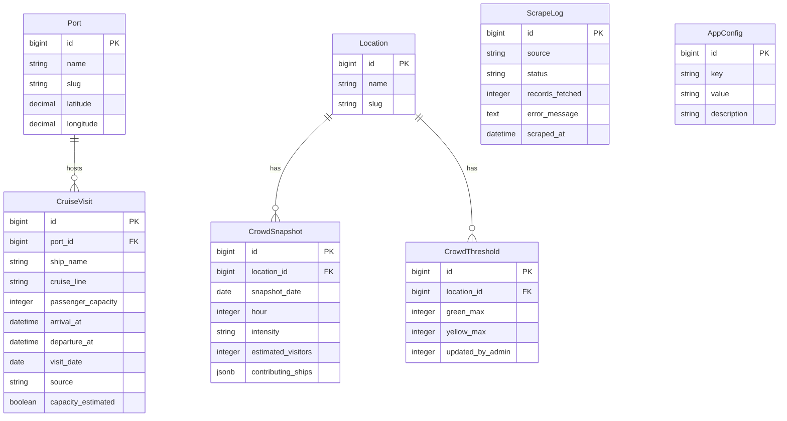

# feat: BVI Cruise Ship Crowd Tool

## Overview

A standalone Rails 8 app that scrapes cruise ship schedule data daily, models hourly crowd intensity at The Baths and White Bay in the BVI, and presents a mobile-first "this week" view so charter captains and guests can find the best time window to visit. No existing tool does this — current options are raw schedule listings with no crowd prediction.

## Problem Statement / Motivation

Charter guests and captains in the BVI want to avoid cruise ship crowds at The Baths (Virgin Gorda) and White Bay (Jost Van Dyke). The only way to check today is to dig through government or third-party schedule sites that show raw data — ship names and dates — with no actionable crowd timing advice. This tool turns raw schedule data into hour-by-hour crowd intensity so users can plan their day around the crowds. (see origin: docs/brainstorms/2026-03-27-bvi-cruise-crowd-tool-requirements.md)

## Proposed Solution

### Data Pipeline
1. **Daily scraper** fetches cruise ship schedules from two sources:
   - **Crew Center** (crew-center.com) — primary source for near-term data (~10 days). Server-rendered HTML tables, trivial to parse with Nokogiri. 4 BVI port pages.
   - **CruiseDig** (cruisedig.com) — extended source for multi-month schedules. Paginated `<li>` lists, same team as Crew Center. Enables the "browse future dates" feature.
2. **Crowd calculation service** takes ship data and generates hourly crowd intensity for The Baths and White Bay using passenger counts, arrival/departure times, transit time estimates, and a Road Town excursion spillover factor.
3. **Heroku Scheduler** runs the scrape + calculation daily. Monitoring alerts via Slack webhook if scraper fails or returns anomalous data.

### Frontend
- Mobile-first "this week" view (rolling 7 days from today)
- Each day shows: ships in port (all BVI ports) + hour-by-hour crowd intensity bars for The Baths and White Bay
- Browse forward/back by week, plus a "jump to date" for trip planning
- Green/yellow/red color coding with per-location thresholds (admin-configurable)

### Admin
- Devise login at `/login` (no public registration)
- Simple admin page to tune: green/yellow/red thresholds per location, transit time estimates, Road Town excursion percentage, capacity utilization factor

## Technical Approach

### Architecture

```
Heroku Scheduler (daily)
  └─> rake scraper:fetch_schedules
        ├─> CrewCenterScraperService (4 port pages, near-term)
        ├─> CruiseDigScraperService (paginated, multi-month)
        └─> CrowdCalculationService (generates hourly intensities)
              └─> Writes CrowdSnapshot records

Browser request
  └─> PagesController#home
        └─> Reads CruiseVisit + CrowdSnapshot for date range
              └─> Renders mobile-first week view
```

### Data Model



### Key Models

**Port** — The 4 BVI cruise ports: Road Town (Tortola), Spanish Town (Virgin Gorda), Jost Van Dyke, Norman Island. Seeded data.

**CruiseVisit** — One record per ship per day per port. Stores raw schedule data. `source` tracks where the data came from (crew_center vs cruisedig). `capacity_estimated` flags ships where we used a lookup table instead of scraped data.

**Location** — The 2 tracked locations: The Baths, White Bay. Seeded data. Separate from Port because a location's crowd comes from multiple ports (The Baths gets visitors from both Virgin Gorda AND Road Town).

**CrowdSnapshot** — Pre-calculated hourly crowd intensity for each location. One record per location per hour per day. `contributing_ships` stores a JSON array of ship names/pax contributing to that hour's estimate. Recalculated after each scrape.

**CrowdThreshold** — Per-location green/yellow/red cutoffs. Admin-editable. `green_max` = max visitors for green; above that is yellow. `yellow_max` = max for yellow; above that is red.

**ScrapeLog** — Every scraper run logged with status, record count, errors. Powers the monitoring system.

**AppConfig** — Key-value store for tunable parameters:
- `transit_time_baths_from_virgin_gorda` (minutes, default: 90)
- `transit_time_baths_from_road_town` (minutes, default: 120)
- `transit_time_white_bay_from_jost` (minutes, default: 20)
- `road_town_baths_excursion_pct` (decimal, default: 0.20)
- `capacity_utilization_pct` (decimal, default: 0.85)
- `slack_webhook_url` (string)

### Crowd Calculation Logic

For each location, for each day, for each hour (6am–8pm BVI time):

1. **Find all contributing ships:**
   - The Baths: ships at Virgin Gorda (100% of pax) + ships at Road Town (`road_town_baths_excursion_pct` of pax)
   - White Bay: ships at Jost Van Dyke (100% of pax)

2. **For each contributing ship, estimate visitors at the location for that hour using a trapezoidal curve:**
   - `effective_pax = passenger_capacity × capacity_utilization_pct × port_contribution_pct`
   - Ramp up: 0 visitors at arrival, linearly increase over `transit_time` minutes to `effective_pax`
   - Plateau: `effective_pax` visitors during the middle of the visit
   - Ramp down: linearly decrease from `effective_pax` to 0 over 90 minutes before departure
   - If hour is outside arrival→departure window: 0

3. **Sum all ships' contributions for that hour** = `estimated_visitors`

4. **Compare to CrowdThreshold for the location:**
   - `estimated_visitors <= green_max` → green
   - `estimated_visitors <= yellow_max` → yellow
   - else → red

5. **Store as CrowdSnapshot** with `contributing_ships` JSON for transparency

### Scraper Services

**CrewCenterScraperService** (`app/services/crew_center_scraper_service.rb`)
- Fetches 4 URLs (one per port) via `Net::HTTP` or `HTTParty`
- Parses `<table class="cruidedig-schedule">` with Nokogiri
- Each row: ship name, cruise line, passenger capacity (European decimal → integer), arrival datetime, departure datetime
- Returns array of hashes; caller handles persistence
- Idempotent: uses `find_or_create_by(ship_name:, visit_date:, port:)`

**CruiseDigScraperService** (`app/services/cruise_dig_scraper_service.rb`)
- Fetches paginated lists from CruiseDig (same data, extended date range)
- Paginates with `?page=N` until no more results
- Same return format as CrewCenterScraperService
- Only fetches data beyond Crew Center's ~10-day window to avoid duplicates

**ScraperMonitorService** (`app/services/scraper_monitor_service.rb`)
- After each scrape run, checks:
  - Did the scraper return data? (zero records = warning)
  - Did the HTML structure match expectations? (parse errors = alert)
  - Is data fresh? (no new records in 48+ hours during charter season = alert)
- Sends Slack webhook on failure/warning
- Logs all runs to ScrapeLog

### Ship Reference Table

For ships with missing passenger capacity, maintain a lookup:
- `db/seeds/ship_capacities.yml` — YAML file mapping ship names → capacity
- Scraper checks this lookup when Crew Center/CruiseDig doesn't provide pax data
- Unknown ships get the median capacity for that port's typical visitors, flagged as `capacity_estimated: true`

### Frontend

**Landing page (`PagesController#home`):**
- Rolling 7-day view starting from today
- Each day card shows:
  - Date + day of week
  - "Ships in Port" summary (all ports — e.g., "3 ships at Road Town · 12,400 pax")
  - The Baths: hour-by-hour color bar (6am–8pm), tap to expand details
  - White Bay: same
- Days with zero ships show "No cruise ships scheduled" message
- Mobile-optimized: single column, cards stack vertically

**Navigation:**
- "← Previous Week" / "Next Week →" arrows
- "Jump to Date" input for trip planners
- All times labeled "BVI Time (AST)"

**Day detail (expandable or tap-through):**
- Hour-by-hour breakdown with estimated visitor count
- Contributing ships per hour (from `contributing_ships` JSON)
- Ship details: name, line, pax, arrival/departure, port

**Tech:** Tailwind CSS v4, Stimulus for interactions (expand/collapse, date navigation), Turbo for page transitions. No heavy JS frameworks.

### Admin

- Devise with single Admin model, registrations disabled
- Custom admin page at `/admin` (simple controller + view, not ActiveAdmin — keeping it lightweight for just threshold tuning)
- Sections:
  - **Crowd Thresholds:** green_max and yellow_max per location (The Baths, White Bay)
  - **Model Parameters:** transit times, excursion percentage, capacity utilization
  - **Scraper Status:** last run time, records fetched, any errors (read from ScrapeLog)
  - **Recalculate button:** triggers crowd recalculation after threshold changes

### Rake Tasks

```ruby
# lib/tasks/scraper.rake
namespace :scraper do
  desc "Fetch cruise ship schedules and recalculate crowd intensities"
  task fetch_schedules: :environment do
    # 1. Run CrewCenterScraperService for near-term data
    # 2. Run CruiseDigScraperService for extended data
    # 3. Persist new CruiseVisit records
    # 4. Run CrowdCalculationService for affected dates
    # 5. Log results to ScrapeLog
    # 6. Alert via ScraperMonitorService if issues
  end
end
```

Heroku Scheduler: `rake scraper:fetch_schedules` — run twice daily (midnight + 6am AST) to catch schedule changes.

### Deployment

- Heroku (standard Matt pattern)
- PostgreSQL add-on
- Heroku Scheduler add-on for daily scraping
- Cloudflare for DNS/HTTPS once domain is chosen
- Figaro for environment variables (`config/application.yml`)
- `SLACK_WEBHOOK_URL` for scraper monitoring

## System-Wide Impact

N/A — greenfield standalone app, no existing systems affected.

## Acceptance Criteria

### Functional Requirements

- [ ] Landing page shows rolling 7-day view with today highlighted (R4)
- [ ] Each day displays all cruise ships in BVI across all 4 ports with ship name, line, pax, arrival/departure times (R1)
- [ ] Each day shows hour-by-hour crowd intensity bar for The Baths (green/yellow/red) (R2)
- [ ] Each day shows hour-by-hour crowd intensity bar for White Bay (green/yellow/red) (R3)
- [ ] The Baths model includes Road Town excursion spillover at configurable percentage (SpecFlow Q1)
- [ ] Users can navigate forward/back by week and jump to a specific date (R5)
- [ ] Days with zero cruise ships display "No cruise ships scheduled" (SpecFlow edge case)
- [ ] All times displayed in BVI Time (AST/UTC-4)
- [ ] Scraper runs automatically via Heroku Scheduler with no manual intervention (R6)
- [ ] Scraper failures trigger Slack alert (R7)
- [ ] ScrapeLog records every run with status and record count (R7)
- [ ] Admin can log in at /login and adjust green/yellow/red thresholds per location (R8)
- [ ] Admin can adjust model parameters (transit times, excursion %, capacity utilization) (R8)
- [ ] Threshold changes trigger crowd recalculation
- [ ] Site is mobile-optimized and loads fast on cellular (R4, success criteria)
- [ ] Small Yacht Warriors attribution link in header/footer (R9)

### Non-Functional Requirements

- [ ] Page loads under 2 seconds on 3G connection (pre-calculated crowd data, no on-the-fly computation)
- [ ] Scraper completes within Heroku Scheduler's 10-minute window
- [ ] Unknown ship capacities are flagged as estimated, not silently defaulted

## Success Metrics

(see origin: docs/brainstorms/2026-03-27-bvi-cruise-crowd-tool-requirements.md)

- A charter guest can pull up the site on their phone and within seconds understand whether today is a good day to visit The Baths or White Bay, and what time window is best
- Data stays current without any manual intervention
- Matt knows promptly if the scraper breaks

## Dependencies & Prerequisites

- Crew Center and CruiseDig continue serving scrapeable HTML (ScrapeLog monitoring catches changes)
- Heroku account with Scheduler add-on
- Slack workspace with incoming webhook for monitoring alerts
- Domain name (TBD)

## Implementation Phases

### Phase 1: Foundation (scaffold + data pipeline)

1. `rails new bvi_cruise_ship` with PostgreSQL, Tailwind CSS v4, importmap
2. Create models: Port, CruiseVisit, Location, CrowdSnapshot, CrowdThreshold, ScrapeLog, AppConfig
3. Seed ports (Road Town, Spanish Town, Jost Van Dyke, Norman Island) and locations (The Baths, White Bay)
4. Seed AppConfig with default parameters
5. Seed ship_capacities reference data
6. Build CrewCenterScraperService + CruiseDigScraperService
7. Build ScraperMonitorService with Slack webhook
8. Create `rake scraper:fetch_schedules` task
9. **Test:** Run scraper locally, verify data in DB

Files:
- `app/models/port.rb`, `cruise_visit.rb`, `location.rb`, `crowd_snapshot.rb`, `crowd_threshold.rb`, `scrape_log.rb`, `app_config.rb`
- `app/services/crew_center_scraper_service.rb`
- `app/services/cruise_dig_scraper_service.rb`
- `app/services/scraper_monitor_service.rb`
- `lib/tasks/scraper.rake`
- `db/seeds.rb`, `db/seeds/ship_capacities.yml`
- `db/migrate/` (7 migrations)

### Phase 2: Crowd Calculation Engine

1. Build CrowdCalculationService with trapezoidal curve model
2. Wire up Road Town → Baths excursion spillover
3. Generate CrowdSnapshot records from CruiseVisit data
4. **Test:** Verify crowd calculations against manual expectations with known ship data

Files:
- `app/services/crowd_calculation_service.rb`

### Phase 3: Frontend

1. Build PagesController#home with rolling 7-day view
2. Design mobile-first day cards with hour-by-hour crowd bars
3. Add week navigation (prev/next arrows) via Turbo
4. Add "Jump to Date" input
5. Add ship detail expandable sections
6. Style with Tailwind — clean, simple, similar to bathsflagstatus.com aesthetic
7. SEO: meta tags, Open Graph, JSON-LD (TouristAttraction schema)
8. YW attribution link in header

Files:
- `app/controllers/pages_controller.rb`
- `app/views/pages/home.html.erb`
- `app/views/pages/partials/` (day card, crowd bar, ship detail)
- `app/views/layouts/application.html.erb`
- `app/javascript/controllers/` (navigation, expand/collapse Stimulus controllers)

### Phase 4: Admin + Deploy

1. Devise setup (Admin model, no registration)
2. Admin controller + views for threshold tuning and model parameters
3. Scraper status dashboard (last run, errors)
4. Recalculate button
5. Heroku deployment (Procfile, Scheduler setup)
6. Cloudflare DNS once domain chosen

Files:
- `app/models/admin.rb`
- `app/controllers/admin_controller.rb`
- `app/views/admin/`
- `Procfile`
- `config/application.yml` (Figaro)

## Key Decisions Carried Forward from Origin

- Scrape (not API) — no free cruise schedule APIs exist (see origin)
- Hourly crowd model over daily rating — the real value is timing within the day (see origin)
- Crew Center primary + CruiseDig for extended range (see origin + planning Q2)
- Road Town excursion spillover included in Baths model at configurable % (planning Q1)
- Per-location thresholds, not global (SpecFlow Q3)
- Rolling 7-day "this week" view, not calendar week (SpecFlow Q4)
- Thresholds tuned after observing real data ~1 month (see origin)
- Heroku Scheduler, Slack monitoring — same patterns as Housekeeper (see origin)

## Sources & References

### Origin

- **Origin document:** [docs/brainstorms/2026-03-27-bvi-cruise-crowd-tool-requirements.md](docs/brainstorms/2026-03-27-bvi-cruise-crowd-tool-requirements.md) — Key decisions: scrape over API, hourly model over daily, Crew Center as primary source, configurable thresholds, standalone site

### Internal References

- Reference app: `/home/dreamstream/projects/flag_status/` — bathsflagstatus.com (service class + rake task + Heroku Scheduler pattern)
- Scraping guide: `docs/scraping-guide.md` — exact HTML structures, Nokogiri examples, URL patterns
- Data sources: `docs/cruise-schedule-sources.md` — comprehensive source comparison and API research
- Housekeeper app: `/home/dreamstream/projects/claude/housekeeper/` — Slack webhook monitoring pattern
